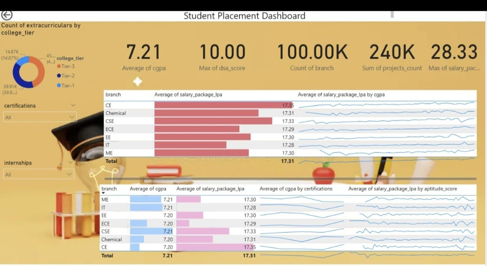

🎓 Student Placement Dashboard (Power BI)
📌 Project Overview

This project presents an interactive Power BI dashboard analyzing student placement data.
The dashboard provides insights into academic performance, skills, and placement outcomes across different branches and college tiers.

It helps stakeholders understand:

Placement trends across branches
Impact of CGPA on salary packages
Role of certifications and internships
Skill-based performance (DSA & aptitude)
Overall placement performance
🖼 Dashboard Preview 

---
📈 Key Performance Indicators (KPIs)
KPI	Value	Description
Average CGPA	7.21	Overall academic performance
Max DSA Score	10.00	Highest problem-solving score
Total Branch Count	100K	Total number of students/branches analyzed
Total Projects	240K	Total projects completed by students
Max Salary Package	28.33 LPA	Highest package offered
🏫 College Tier Analysis

The dashboard includes a donut chart showing extracurricular participation across college tiers.

Tiers Covered
Tier
Tier 1
Tier 2
Tier 3
Key Insights
Tier 2 colleges show the highest participation
Extracurricular involvement varies across tiers
College tier impacts placement opportunities
📊 Branch-wise Salary Analysis

This section compares average salary packages across different branches.

Branches Included
Branch
CSE
CE
ECE
EE
IT
Mechanical
Chemical
Insights
CSE and CE have the highest average salary packages
Core branches show relatively stable salary trends
Technical fields dominate placement outcomes
📈 Salary & Performance Trends

The dashboard includes multiple trend analyses:

📌 Salary vs CGPA
Higher CGPA generally leads to better salary packages
📌 Salary vs Aptitude Score
Strong aptitude skills improve placement chances
📌 CGPA vs Certifications
Certifications positively impact academic performance
🏷 Student Performance Factors

The dashboard highlights key factors influencing placements:

Factors Included
Factor
CGPA
DSA Score
Certifications
Internships
Projects
Insights
Students with certifications perform better
Internships improve employability
Higher project count reflects practical exposure
🎛 Dashboard Filters

Users can interact with the dashboard using:

Certifications Filter
Analyze impact of certifications
Internships Filter
Compare students with/without internships
📊 Features of the Dashboard
Interactive Power BI visuals
Branch-wise comparison
KPI summary cards
Trend analysis charts
Skill-based performance insights
Clean and intuitive UI
🧠 Business Insights
1️⃣ Academic Impact

Higher CGPA significantly influences placement outcomes.

2️⃣ Skill Importance

DSA and aptitude scores play a crucial role in hiring.

3️⃣ Practical Exposure

Internships and projects enhance employability.

4️⃣ Branch Trends

Tech branches receive higher salary packages.

5️⃣ Certifications Value

Additional certifications boost both CGPA and placement chances.

🛠 Tools & Technologies
Tool	Purpose
Power BI	Data visualization
Dataset	Student placement data
DAX	Measures & calculations
Excel	Data preprocessing
GitHub	Project hosting
📂 Project Structure

Student-Placement-Dashboard
│
├── Dataset
│ └── placement_data.csv
│
├── PowerBI
│ └── placement_dashboard.pbix
│
├── Images
│ └── placement image .jpg
│
└── README.md

🚀 How to Use
Download the .pbix file
Open in Power BI Desktop
Use filters to explore:
Branch performance
Salary trends
Skill impact
Analyze insights interactively
📌 Future Improvements
Add company-wise placement analysis
Include time-series placement trends
Add salary distribution by role
Implement predictive analytics
👩‍💻 Author

Vetali Mittal
Economics Honours Student | Data Enthusiast | Power BI Learner
